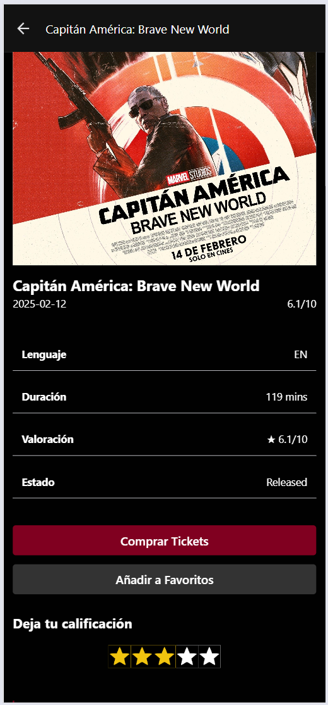
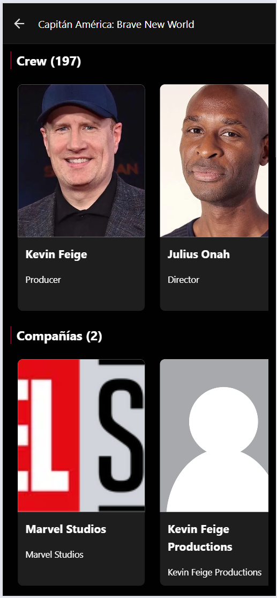

# Lorenzo Movies Inc

Movies Inc es una nueva startup. Su visión es convertirse en el único lugar para descubrir y reservar para ver películas y cine. Su estrategia es primero introducir una aplicación móvil que permita a sus clientes descubrir películas en las cuales podrían estar interesados de ver. Una vez construyan una base de clientes sólida, van a introducir la funcionalidad de reserva para ver películas en teatros. Ellos te han pedido que les ayudes a construir su aplicación móvil.

# **Solución**

Para desarrollar la plataforma de **Lorenzo Movies Inc**, se implementaron dos aplicaciones complementarias:

1. **Aplicación móvil**: Desarrollada con **React Native y Expo**, permite a los usuarios descubrir películas de su interés de manera intuitiva y fluida. Expo facilita la gestión del proyecto y el despliegue en dispositivos iOS y Android, asegurando una experiencia optimizada en dispositivos móviles.

2. **Aplicación web**: Desarrollada con **React y Vite**, proporciona una alternativa accesible desde cualquier navegador. Se priorizó el rendimiento y la velocidad de carga mediante el uso de **Vite**, mientras que **TypeScript** garantiza un código más estructurado y mantenible.

Ambas aplicaciones comparten una arquitectura basada en **TypeScript**, lo que facilita la consistencia en el desarrollo, la reutilización de componentes y la escalabilidad del proyecto.

Además, se han diseñado con un enfoque modular para permitir futuras integraciones, como la funcionalidad de reserva de películas en teatros, alineándose con la estrategia de crecimiento de la startup. 🚀

# **Instalación**

## **Requisitos previos**

Asegúrate de tener instalados los siguientes programas en tu sistema:

- **Node.js** (versión recomendada: LTS)
- **Git** (opcional, pero recomendado)
- **Expo CLI** (para la aplicación móvil)
- **Vite** (para la aplicación web)

Si no tienes **Expo CLI**, instálalo con el siguiente comando:

```sh
npm install -g expo-cli
```

## **Instalación de la aplicación web**

1. Clona el repositorio:

```sh
git clone https://github.com/JorgelRight34/movies
```

2. Navega al directorio de la aplicación web:

```sh
cd lorenzo-movies/web
```

3. Instala las dependencias:

```sh
npm install
```

4. Inicia el servidor de desarrollo:

```sh
npm run dev
```

La aplicación estará disponible en `http://localhost:5173/` por defecto.

## **Instalación de la aplicación móvil**

1. Navega al directorio de la aplicación móvil:

```sh
cd lorenzo-movies/mobile
```

2. Instala las dependencias:

```sh
npm install
```

3. Inicia la aplicación con Expo:

```sh
npx expo start
```

Escanea el código QR con la aplicación **Expo Go** en tu dispositivo móvil o usa un emulador para probar la app.

## **Ejecutar pruebas**

Ambas aplicaciones incluyen pruebas para garantizar su correcto funcionamiento. Para ejecutar las pruebas unitarias, usa el siguiente comando en cada proyecto:

```sh
npm test
```

Si estás utilizando **Vitest** en la aplicación web, puedes ejecutar:

```sh
npm test
```

Para correr pruebas en la aplicación móvil con **Jest**, usa:

```sh
npm test
```

Esto garantizará que todas las funcionalidades clave se mantengan estables a lo largo del desarrollo. ✅

```

```

# 📅 Sprint 1

## 🎬 FF-1 (Web) - Lista de películas en cartelera

Los clientes pueden ver una lista de películas que se están reproduciendo actualmente.

### 🖥️ Lista en versión escritorio


### 📱 Lista en versión móvil

<div style="text-align: center;">
  
</div>

#### 📌 Características:

- Muestra el título de la película, fecha de estreno, calificación promedio y cartel.
- Solo muestra la primera página de resultados.
- Ordenada alfabéticamente.

---

## 📱 FF-1 (App Móvil) - Lista de películas en cartelera

Los clientes pueden ver una lista de películas en la app móvil.

<div style="text-align: center;">
  
</div>

#### 📌 Características:

- Muestra el título, fecha de estreno, calificación y cartel.
- Solo muestra la primera página de resultados.
- Ordenada alfabéticamente.

---

## 🎥 FF-2 (Web) - Detalles de una película

Los clientes pueden ver más detalles de una película.

### 🖥️ Versión escritorio


.png>)
.png>)
.png>)

### 📱 Versión móvil

<div style="text-align: center;">
  
  
</div>

#### 📌 Características:

- Incluye el título, año de estreno, descripción, género y calificación.
- Muestra una lista de actores y los personajes que interpretan.

---

## 🎥 FF-2 (App Móvil) - Detalles de una película

Los clientes pueden ver más detalles de una película en la app móvil.

<div style="text-align: center;">
  
  
  
</div>

#### 📌 Características:

- Incluye título, año de estreno, descripción, género y calificación.
- Muestra una lista de actores y sus personajes.

---

## ⭐ FF-3 - Votar por una película

Los clientes pueden calificar una película con estrellas.

### 📽️ Vista previa:


#### 📌 Características:

- Los usuarios pueden calificar una película usando estrellas.
- La calificación se guarda en la API.

---

# 🚀 Sprint 2 (Opcional)

## 🎞️ FF-4 - Películas similares/recomendadas

### 🖥️ Web


### 📱 App Móvil


#### 📌 Características:

- Los clientes pueden ver una lista de películas similares o recomendadas.

---

## ❤️ FF-5 - Añadir a favoritos

### 🖥️ Web


### 📱 App Móvil


#### 📌 Características:

- Los clientes pueden añadir películas a su lista de favoritos.
