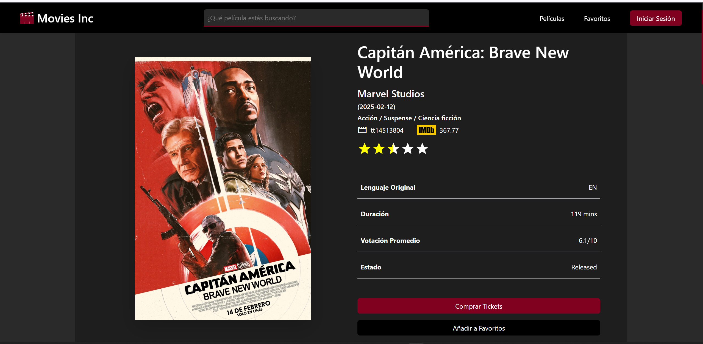
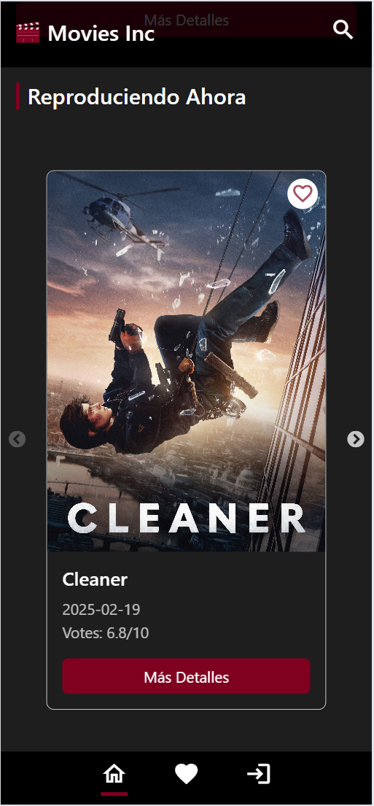
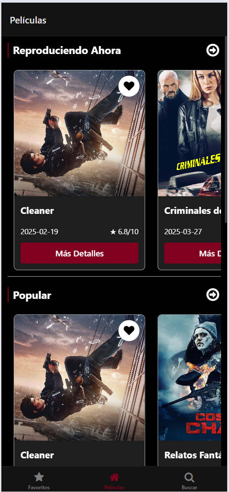
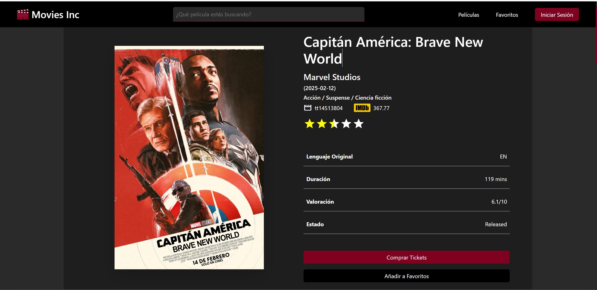
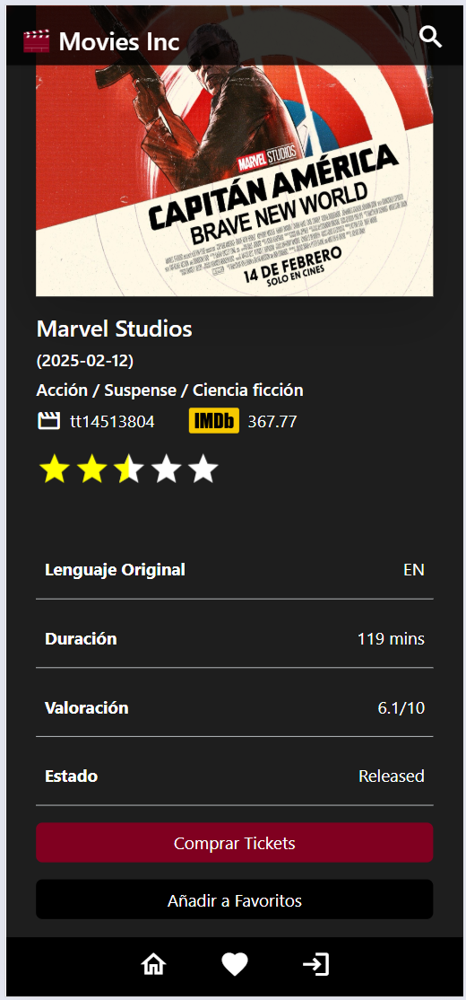
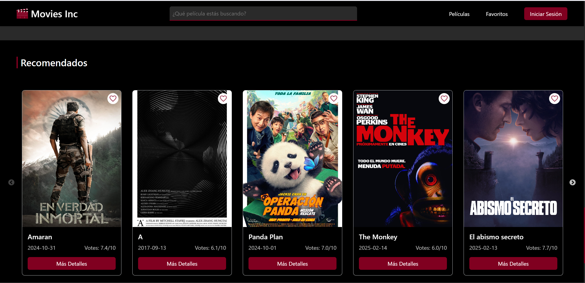
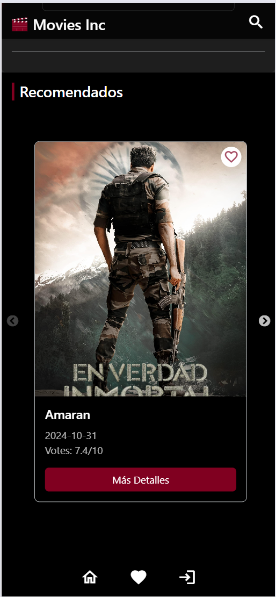
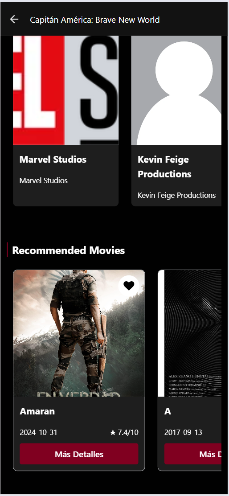
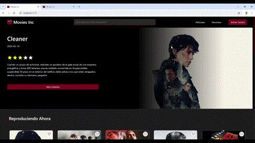

# Lorenzo Movies Inc

Movies Inc es una nueva startup. Su visión es convertirse en el único lugar para descubrir y reservar para ver películas y cine. Su estrategia es primero introducir una aplicación móvil que permita a sus clientes descubrir películas en las cuales podrían estar interesados de ver. Una vez construyan una base de clientes sólida, van a introducir la funcionalidad de reserva para ver películas en teatros. Ellos te han pedido que les ayudes a construir su aplicación móvil.

# **Solución**

Para desarrollar la plataforma de **Lorenzo Movies Inc**, se implementaron dos aplicaciones complementarias:

1. **Aplicación móvil**: Desarrollada con **React Native y Expo**, permite a los usuarios descubrir películas de su interés de manera intuitiva y fluida. Expo facilita la gestión del proyecto y el despliegue en dispositivos iOS y Android, asegurando una experiencia optimizada en dispositivos móviles.

2. **Aplicación web**: Desarrollada con **React y Vite**, proporciona una alternativa accesible desde cualquier navegador. Se priorizó el rendimiento y la velocidad de carga mediante el uso de **Vite**, mientras que **TypeScript** garantiza un código más estructurado y mantenible. Se encuentra en [Este enlace](https://lorenzo-movies-inc.vercel.app/)

Ambas aplicaciones comparten una arquitectura basada en **TypeScript**, lo que facilita la consistencia en el desarrollo, la reutilización de componentes y la escalabilidad del proyecto.

Además, se han diseñado con un enfoque modular para permitir futuras integraciones, como la funcionalidad de reserva de películas en teatros, alineándose con la estrategia de crecimiento de la startup. 🚀

# **Instalación**

## **Requisitos previos**

Asegúrate de tener instalados los siguientes programas en tu sistema:

- **Node.js** (versión recomendada: LTS)
- **Git** (opcional, pero recomendado)
- **Expo CLI** (para la aplicación móvil)
- **Vite** (para la aplicación web)

Si no tienes **Expo CLI**, instálalo con el siguiente comando:

```sh
npm install -g expo-cli
```

## **Instalación de la aplicación web**

1. Clona el repositorio:

```sh
git clone https://github.com/JorgelRight34/movies
```

2. Navega al directorio de la aplicación web:

```sh
cd web
```

3. Instala las dependencias:

```sh
npm install
```

4. Inicia el servidor de desarrollo:

```sh
npm run dev
```

La aplicación estará disponible en `http://localhost:5173/` por defecto.

## **Instalación de la aplicación móvil**

1. Navega al directorio de la aplicación móvil:

```sh
cd mobile
```

2. Instala las dependencias:

```sh
npm install
```

3. Inicia la aplicación con Expo:

```sh
npm start
```

Escanea el código QR con la aplicación **Expo Go** en tu dispositivo móvil o usa un emulador para probar la app.

## **Ejecutar pruebas**

Ambas aplicaciones incluyen pruebas para garantizar su correcto funcionamiento. Para ejecutar las pruebas unitarias, usa el siguiente comando en cada proyecto:

```sh
npm test
```

Si estás utilizando **Vitest** en la aplicación web, puedes ejecutar:

```sh
npm test
```

Para correr pruebas en la aplicación móvil con **Jest**, usa:

```sh
npm test
```

Esto garantizará que todas las funcionalidades clave se mantengan estables a lo largo del desarrollo. ✅

```

```

# 📅 Sprint 1

## 🎬 FF-1 - Lista de películas en cartelera

Los clientes pueden ver una lista de películas que se están reproduciendo actualmente.

### 🌐 Página Web

#### 🖥️ Versión Escritorio



#### 📱 Versión Móvil

<div style="text-align: center;">
  
</div>

#### 📌 Características:

- Muestra el título de la película, fecha de estreno, calificación promedio y cartel.
- Solo muestra la primera página de resultados.
- Ordenada alfabéticamente.

### 📱 Aplicación Móvil

<div style="text-align: center;">
  
</div>

#### 📌 Características:

- Muestra el título, fecha de estreno, calificación y cartel.
- Solo muestra la primera página de resultados.
- Ordenada alfabéticamente.

---

## 🎥 FF-2 - Detalles de una película

Los clientes pueden ver más detalles de una película.

### 🌐 Página Web

#### 🖥️ Versión Escritorio


.png>)
.png>)
.png>)

#### 📱 Versión Móvil

<div style="text-align: center;">
  
  
</div>

#### 📌 Características:

- Incluye el título, año de estreno, descripción, género y calificación.
- Muestra una lista de actores y los personajes que interpretan.

### 📱 Aplicación Móvil

<div style="text-align: center;">
  
</div>

#### 📌 Características:

- Incluye título, año de estreno, descripción, género y calificación.
- Muestra una lista de actores y sus personajes.

---

## ⭐ FF-3 - Votar por una película (Web)

Los clientes pueden calificar una película con estrellas.

### 📽️ Vista Previa

<div style="text-align: center;">
  
</div>

#### 📌 Características:

- Los usuarios pueden calificar una película usando estrellas.
- La calificación se guarda en la API.

## ⭐ FF-3 - Votar por una película (App Móvil)

Los clientes pueden calificar una película con estrellas.

### 📽️ Vista Previa

<div style="text-align: center;">
  
</div>

#### 📌 Características:

- Los usuarios pueden calificar una película usando estrellas.
- La calificación se guarda en la API.

---

# 📅 Sprint 2 (Opcional)

## 🎞️ FF-4 - Películas similares/recomendadas

Los clientes pueden ver una lista de películas similares o recomendadas.

### 🌐 Página Web

#### 🖥️ Versión Escritorio



#### 📱 Versión Móvil

<div style="text-align: center;">
  
</div>

### 📱 Aplicación Móvil

<div style="text-align: center;">
  
</div>

---

## ❤️ FF-5 - Añadir a favoritos

Los clientes pueden añadir películas a su lista de favoritos.

### 🌐 Página Web


<div style="text-align: center;">
  
</div>

### 📱 Aplicación Móvil


#### 📌 Características:

- Los clientes pueden añadir películas a su lista de favoritos.

---

# Extras personales

Le agregué a las aplicaciones un toque personal añadiendo nuevas funcionalidades.

### 1. Búsqueda de películas

#### 🌐 Página Web


<div style="text-align: center;">
  
</div>

#### 📱 Aplicación Móvil

<div style="text-align: center;">
  
</div>

La búsqueda se realiza cada 500 ms para evitar realizar una solicitud por cada letra ingresada. Si se escribe una nueva letra antes de que transcurran los 500 ms, se cancela la espera de la solicitud anterior y se inicia una nueva. Los resultados de la búsqueda se muestran en tiempo real mientras se escribe en la página de búsqueda.

### 2. Autenticación



---

## 🏗️ Arquitectura del Software

### Arquitectura de Software: React/React Native con Principios SOLID y Axios

Me enfoqué en diseñar una arquitectura limpia siguiendo las mejores prácticas de desarrollo con **React** y **React Native**, aplicando el principio de **responsabilidad única** (SOLID). Cada componente, hook o servicio cumple una única función, lo que permite:

- **Modularidad**: El código funciona como piezas de Lego: puedes remover, mover o modificar componentes sin romper funcionalidades existentes.
- **Mantenibilidad**: Cambios futuros son más seguros y predecibles.
- **Testabilidad**: Cada parte puede ser probada de forma aislada.

#### **Estructura y Responsabilidades**

✅ **Componentes** → Se encargan únicamente del **renderizado** (DOM/React Native).
✅ **Hooks** → Gestionan el **estado** y los **efectos** de la aplicación.
✅ **Servicios** → Abstraen la comunicación con **APIs** y manejan _side-effects_.
✅ **Modelos** → Definen la **estructura** de los objetos retornados por la API.

También me enfoqué en hacer el código altamente **tipado** con **TypeScript**, utilizando **modelos** para cada objeto retornado por la API.

#### **Beneficios**

✅ Proporciona **sugerencias intuitivas** durante el desarrollo.
✅ Facilita la **creación y manipulación** de objetos de manera segura.
✅ Previene errores, haciendo que el código sea más **robusto** y **mantenible**.

## Implementación Clave

## Hooks

### useAddMovieToFavorites

```javascript
const useAddMovieToFavorites = () => {
  const addMovieToFavorites = async (id: number, favorite = true) => {
    const response = await api.post(`account/${ACCOUNT_ID}/favorite`, {
      media_type: "movie",
      media_id: id,
      favorite: favorite,
    });

    if (response.data.success) {
      toast.success(
        favorite
          ? "¡Película AGREGADA a favoritos!"
          : "¡Película ELIMINADA de favoritos!"
      );
    }
  };

  return addMovieToFavorites;
};

export default useAddMovieToFavorites;
```

Este _hook_ devuelve una función que permite agregar cualquier película a la lista de favoritos del usuario correspondiente, identificado por `ACCOUNT_ID` (por defecto `null`).

#### **Definición de `ACCOUNT_ID`**

```javascript
export const ACCOUNT_ID = localStorage.getItem("sessionId") || null;
```

El _ID_ de la cuenta se obtiene desde `localStorage`. Aunque este enfoque pueda parecer simple, tiene varias ventajas:  
✅ Facilita el uso de `ACCOUNT_ID` en lugar de acceder directamente a `localStorage`.  
✅ Mejora la **flexibilidad**: si la clave en `localStorage` cambia (por ejemplo, de `"sessionId"` a `"id"`), solo es necesario modificar esta constante en un solo lugar, evitando cambios en múltiples archivos.

#### **Funcionamiento del Hook**

- Realiza una solicitud **POST** a la API para actualizar la lista de favoritos asociada a la cuenta.
- Si no hay una cuenta registrada, se usa el _ID_ por defecto (`null`).
- Si la solicitud es exitosa, se muestra un **mensaje `toast`** en la parte superior de la pantalla, proporcionando retroalimentación al usuario de que la película se agregó correctamente a favoritos.

---

Este texto es más claro, profesional y estructurado. 🚀 ¿Te gustaría algún ajuste adicional? 😊

### useFavorites

```javascript
const useFavorites = (): UseFavoritesReturn => {
  const [favoriteMovies, setFavoriteMovies] = useState<Movie[]>([]);
  const [page, setPage] = useState(1);
  const [totalPages, setTotalPages] = useState(0);

  const getFavoriteMovies = async () => {
    const response = await api.get(
      `account/${ACCOUNT_ID}/favorite/movies?page=${page}&sort_by=created_at.asc`
    );
    setFavoriteMovies(response.data.results);
    setTotalPages(response.data.total_pages);
  };

  const goToNextPage = () => {
    if (page + 1 <= totalPages) setPage((prev) => prev + 1);
  };

  const goToPrevPage = () => {
    if (page - 1 != 0) setPage((prev) => prev - 1);
  };

  useEffect(() => {
    getFavoriteMovies();
  }, [page]);

  return { favoriteMovies, page, totalPages, goToNextPage, goToPrevPage };
};

export default useFavorites;
```

Este **hook** retorna la lista de películas favoritas del usuario, utilizando el correspondiente `ACCOUNT_ID` (por defecto `null`).

#### **Paginación de Resultados**

- Inicialmente, solo solicita la **primera página** de favoritos.
- Proporciona funciones para **avanzar** y **retroceder** entre páginas.
- Cuando se cambia de página, el estado `favoriteMovies` se actualiza automáticamente, reflejando la nueva lista de favoritos.

#### **Manejo de Errores**

- No permite solicitar una página mayor al total disponible.
- No permite solicitar una página menor que `1`.

### useMovie

```javascript
interface UseMovieReturn {
  movie: Movie | null;
  credits: { cast: Actor[]; crew: Worker[] };
  voteForMovie: (rating: number) => void;
}

/* ... */

const useMovie = (id: string): UseMovieReturn => {
  const [movie, setMovie] = useState<Movie | null>(null);
  const [credits, setCredits] = useState<{ cast: Actor[]; crew: Worker[] }>({
    cast: [],
    crew: [],
  });

  const fetchMovie = async () => {
    const response = await api.get(`movie/${id}?append_to_response=videos`);
    if (response.status === 404) window.location.href = "/";
    setMovie(response.data);
  };

  const voteForMovie = async (rating: number) => {
    const response = await api.post(`movie/${id}/rating?`, {
      value: rating > 0 ? rating : 0.1,
    });

    if (response.data.success) {
      toast.success(`Has dejado una valoración de ${rating}/10!`);
      fetchMovie(); // Update movie
    }
  };

  const fetchMovieCredits = async () => {
    const response = await api.get(`movie/${id}/credits`);
    setCredits(response.data);
  };

  useEffect(() => {
    fetchMovie();
    fetchMovieCredits();
  }, [id]);

  return { movie, credits, voteForMovie };
};

export default useMovie;
```

Este **hook** retorna:  
✅ La información de una película específica.  
✅ Los **créditos**, incluyendo el _cast_ (actores) y el _crew_ (equipo de producción).  
✅ Una función para **valorar** la película en un rango de `0` a `10`, siguiendo el formato aceptado por la API de TMDB.

#### **Solicitud de Información a la API**

- Obtiene los **detalles** de la película según su `id`.
- Incluye los **videos**, permitiendo extraer el _tráiler_ y mostrarlo en la página de detalles.

#### **Valoración de la Película**

- Al valorar una película, se muestra un **toast** (mensaje emergente) indicando que la valoración ha sido registrada.
- La puntuación se convierte a una escala de **5 estrellas** y se adapta a la escala de `1` a `10` utilizada por TMDB.

---

### useMovies

```javascript
const useMovies = (
  endpoint: MovieFilter = "now_playing",
  query: string = ""
): {
  movies: Movie[];
  page: number;
  totalPages: number;
  goToNextPage: () => void;
  goToPrevPage: () => void;
  fetchMovies: () => void;
} => {
  const [movies, setMovies] = useState<Movie[]>([]);
  const [page, setPage] = useState(1);
  const [totalPages, setTotalPages] = useState(0);

  const fetchMovies = async () => {
    // Get path, if search is specified create the specific endpoint search/movie
    const path = `${endpoint === "search" ? endpoint : "movie"}/${endpoint === "search" ? "movie" : endpoint
      }`;

    // Fire request and get response
    const response = await api.get(
      `${path}?page=${page}&sort_by=original_title.desc&${query}`
    );

    // Update states
    setMovies(response.data.results);
    setTotalPages(response.data.total_pages);
  };

  const goToNextPage = () => {
    if (page + 1 <= totalPages) setPage((prev) => prev + 1);
  };

  const goToPrevPage = () => {
    if (page - 1 != 0) setPage((prev) => prev - 1);
  };

  useEffect(() => {
    fetchMovies();
  }, [page]);

  return {
    movies,
    page,
    totalPages,
    goToNextPage,
    goToPrevPage,
    fetchMovies,
  };
};

export default useMovies;
```

Este **hook** retorna:  
✅ Una **lista de películas** obtenida desde la API.  
✅ La **página actual** y el **número total de páginas**.  
✅ Funciones para **navegar** entre páginas:

- **Siguiente página**
- **Página anterior**  
  ✅ Una función para **obtener películas** de la API según un filtro específico.

#### **Parámetros y Filtros**

Este _hook_ acepta un **filtro opcional** para buscar películas. Algunos ejemplos de filtros (_definidos en un modelo TypeScript_) son:

- `"playing_now"` → Películas en cartelera.
- `"popular"` → Películas populares.
- `"upcoming"` → Próximos estrenos.
- `"search"` → Búsqueda personalizada con un parámetro opcional `query`.

Si el filtro es `"search"` y se proporciona un `query`, el _hook_ buscará películas en la API que coincidan con ese término.

---

### useRecommendedMovies

```javascript
const useRecommendedMovies = (id: string): Movie[] => {
  const [movies, setMovies] = useState<Movie[]>([]);

  const fetchMovies = async () => {
    const response = await api.get(
      `movie/${id}/recommendations?sort_by=original_title.desc`
    );
    setMovies(response.data.results);
  };

  useEffect(() => {
    fetchMovies();
  }, []);

  return movies;
};

export default useRecommendedMovies;
```

Este **hook** retorna una lista de películas **recomendadas** o **similares** a una película específica, identificada por su `id` (_string_).

### **Características**

✅ Obtiene películas recomendadas desde la API.  
✅ Ordena los resultados por **título en orden descendente**.

---

## Capa de Servicios: Axios Configurado

Centralicé todas las llamadas HTTP en un objeto de Axios con interceptores para:

- **Configuración automática** (tokens, headers, parámetros).
- **Manejo global de errores**.
- **Feedback visual unificado** (loading bars, toasters).

### Axios

```javascript
import axios, { AxiosError, InternalAxiosRequestConfig } from "axios";
import { completeLoadingBar } from "../components/common/LoadingBar";
import { toast } from "react-toastify";
import { ACCESS_TOKEN, API_KEY, LANGUAGE } from "../lib/constants";

const api = axios.create({
  baseURL: "https://api.themoviedb.org/3/",
});

api.interceptors.request.use(
  async (
    config: InternalAxiosRequestConfig
  ):
    | Promise<InternalAxiosRequestConfig>
    | Promise<InternalAxiosRequestConfig> => {
    // Include access token on all requests
    config.headers.Authorization = `Bearer ${ACCESS_TOKEN}`;

    // Append language query and api key parameter to all requests
    config.params = { language: LANGUAGE, API_KEY: API_KEY, ...config.params };

    return config;
  },
  (error: AxiosError) => {
    return Promise.reject(error);
  }
);

api.interceptors.response.use(
  (response) => {
    completeLoadingBar();
    return response;
  },
  (error) => {
    if (error instanceof AxiosError) {
      handleError(error);
    } else {
      toast.error("An error has ocurred");
    }

    completeLoadingBar();
    return Promise.reject(error);
  }
);

const handleError = (error: AxiosError) => {
  switch (error.code) {
    case "ERR_NETWORK":
      toast.error(
        "Conexión rechazada. Asegúrate de tener una conexión estable."
      );
      break;
    case "ERR_BAD_RESPONSE":
      toast.error("¡Ups! Error interno del servidor.");
      break;
    case "ERR_BAD_REQUEST":
      switch (error.response?.status) {
        case 404:
          toast.error("No encontrado.");
          break;
        case 401:
          toast.error("No autorizado.");
          break;
        default:
          toast.error("Solicitud incorrecta.");
          break;
      }
      break;
    default:
      toast.error("Ha ocurrido un error.");
      break;
  }
};

export default api;
```

## Abstracción y Centralización de la Configuración para Llamadas a la API

Este objeto encapsula toda la configuración necesaria para realizar solicitudes a la API de manera eficiente y consistente.

### **Parámetros Automáticos en Cada Llamada**

- Siempre incluye la `API_KEY` como parámetro en las solicitudes `GET`, evitando la necesidad de declararla manualmente en cada hook.
- Añade automáticamente el _access token_ en los **headers** de autorización, garantizando autenticación en cada solicitud.
- Incorpora el **idioma** como un parámetro `GET` en cada petición, asegurando que las respuestas se adapten al idioma configurado.

### **Manejo Centralizado de Errores**

- Este objeto gestiona los errores de forma global, eliminando la necesidad de usar `try/catch` en otras partes de la aplicación.
- Implementa un **interceptor** que detecta los errores y muestra un **toaster** (mensaje emergente en pantalla) con una descripción amigable del problema.
- Cada código de error HTTP tiene un mensaje específico, como se define en el archivo correspondiente.

### **Indicador de Carga Automático**

- Utiliza **interceptores** para activar una **barra de carga** en la parte superior de la pantalla al iniciar una solicitud, proporcionando retroalimentación visual al usuario y al desarrollador.
- Al finalizar la solicitud, otro interceptor completa la barra de carga, indicando que la operación ha concluido.

### **Beneficios de la Centralización**

Con este objeto logramos:  
✅ **Estandarizar** los parámetros `GET` requeridos para la comunicación con la API.  
✅ **Automatizar la autenticación**, evitando configuraciones repetitivas.  
✅ **Manejar errores de manera uniforme**, con mensajes informativos para usuarios y desarrolladores.  
✅ **Optimizar la experiencia de usuario**, proporcionando una barra de carga automática en cada solicitud.

---

## Modelos

Los **modelos** representan los **objetos** que la API retorna en formato **JSON**. Esto permite trabajar con un código más robusto y mejora significativamente la experiencia de desarrollo.

Siempre me enfoco en ordenar **alfabéticamente** las propiedades de un modelo, lo que facilita encontrar rápidamente lo que se necesita modificar o trabajar durante el desarrollo.

### Actor

```javascript
export interface Actor extends Person {
  castId: number;
  character: string;
  order: number;
}
```

`Actor` extiende la interfaz `Persona`, reutilizando su estructura para **evitar duplicación** (_DRY_). Esta misma interfaz también se usa en `Worker`, que representa a los miembros del _crew_ de una película.

### Genre

```javascript
export interface Genre {
  id: number;
  name: string;
}
```

Representa el **género** de una pelicula

### Language

```javascript
export interface Language {
  english_name: string;
  name: string;
  iso_639_1: string;
}
```

Representa un **lenguaje**

### Movie

```javascript
export interface Movie {
  adult: boolean;
  backdrop_path: string;
  genres?: Genre[];
  genre_ids?: number[];
  homepage?: string;
  id: number;
  imdb_id?: number;
  original_language: string;
  original_title: string;
  overview: string;
  popularity: number;
  poster_path: string;
  production_companies?: ProductionCompany[];
  release_date: string;
  runtime: number;
  spoken_languages?: Language[];
  status?: string;
  tagline?: string;
  title: string;
  video: boolean;
  vote_average: number;
  vote_count: number;
  videos?: { results: Video[] };
}
```

Representa una película, incluyendo información como título, idioma, géneros, duración, calificación y detalles de producción.

### MovieFilter

```javascript
export type MovieFilter =
  | "now_playing"
  | "popular"
  | "top_rated"
  | "upcoming"
  | "search"
  | "trending";
```

### MovieFilter

```javascript
export type MovieFilter =
  | "now_playing"
  | "popular"
  | "top_rated"
  | "upcoming"
  | "search"
  | "trending";
```

Representa los **posibles filtros** que se pueden utilizar para buscar películas en la API. Estos filtros son mejor aprovechados en el **hook** `useMovies`.

### Person

```javascript
export interface Person {
  adult: boolean;
  gender: string;
  id: number;
  name: string;
  original_name: string;
  popularity: number;
  profile_path: string;
  credit_id: string;
}
```

Representa una **persona** con los atributos básicos que la identifican. Esta interfaz es extendida por `Actor` y `Worker`, permitiendo reutilizar la información común entre diferentes tipos de personas.
Aquí tienes la interfaz `ProductionCompany` mejorada en **Markdown**:

### ProductionCompany

```javascript
export interface ProductionCompany {
  id: number;
  logo_path: string;
  name: string;
  origin_country: string;
}
```

Representa una **compañía de producción** que estuvo involucrada en la creación de una película, incluyendo su **nombre**, **logo** y el **país de origen**.

Aquí tienes la interfaz `Video` mejorada en **Markdown**:

---

### Video

```javascript
export interface Video {
  iso_3166_1: string;
  iso_639_1: string;
  id: string;
  key: string;
  name: string;
  official: boolean;
  published_at: string;
  site: string;
  size: number;
  type: "Trailer" | "Teaser";
}
```

Representa un **video** asociado a una película, como un **tráiler** o **teaser**, con detalles sobre su **origen**, **tamaño**, y **estado oficial**.

### Worker

```javascript
export interface Worker extends Person {
  department: string;
  job: string;
}
```

Representa a un **trabajador** que forma parte del **equipo de producción (crew)** de una **película**, con información adicional sobre su **departamento** y **puesto** dentro del proyecto.
